# DesktopSQLVisualizer - User Guide

Version: 1.0.0

## 1. Application Overview

DesktopSQLVisualizer is a desktop SQL client for:

- MSSQL
- MySQL
- PostgreSQL
- DB2

Main sections:

- Connections
- SQL Workspace
- ER Diagram

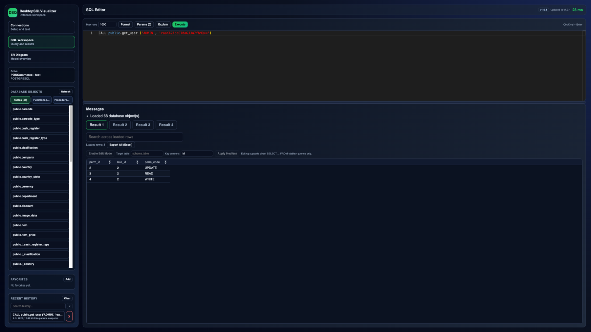

## 2. Connections

In the **Connections** tab, configure a new or existing connection:

1. Click **New**.
2. Fill in Name, Engine, Host, Port, Username, Password.
3. Click **Test connection**.
4. If needed, click **Load databases**.
5. Click **Save connection**.
6. Click **Open SQL Workspace**.

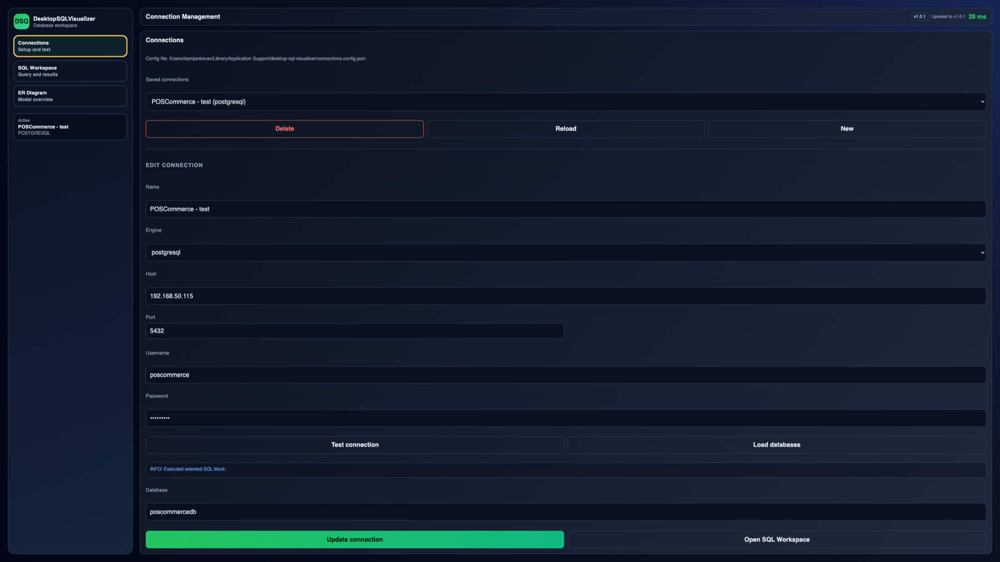

## 3. SQL Workspace

Available controls in the SQL editor:

- **Max rows**
- **Format**
- **Params**
- **Explain**
- **Execute**

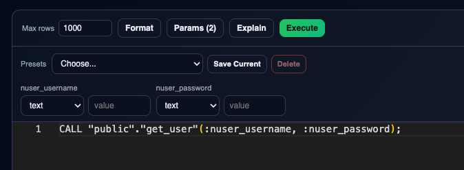

### Query Execution

- If part of SQL text is selected, only the selected part is executed.
- If nothing is selected, the whole editor content is executed.

Shortcut:

- `Ctrl/Cmd + Enter` -> Execute

### Explain

The **Explain** button runs query plan explanation (depends on engine support).
Useful for:

- slow query analysis,
- index usage checks,
- comparing optimization changes.

### Max rows

**Max rows** sets the maximum number of rows loaded per resultset.
Recommendation:

- use a lower value (for example 500) for faster work on large tables,
- increase before execution if you need bigger outputs.

### Format SQL

The **Format** button reformats SQL (indentation/keyword layout) for better readability.

## 4. Results (multi-resultset)

After execution, results are shown in the lower panel:

- multiple result tabs (`Result 1`, `Result 2`, ...),
- result search,
- column sorting,
- Excel export.

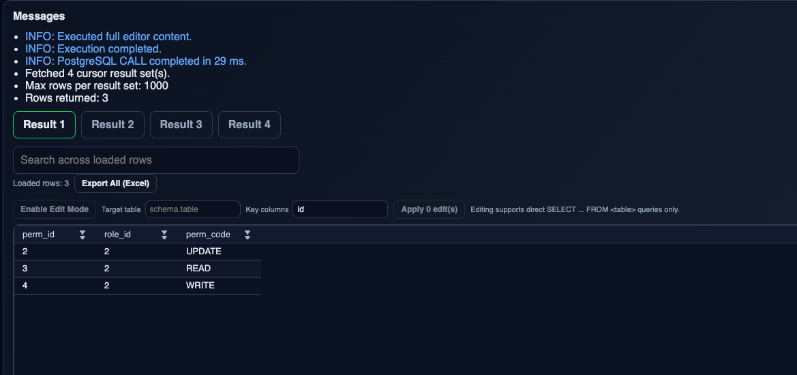

### Messages panel

The **Messages** panel includes:

- execution info,
- warnings and errors,
- returned row count,
- execution timing.

This is the first place to check when execution fails.

## 5. Data Editing (Edit Mode)

If the result is editable:

1. Click **Enable Edit Mode**.
2. Modify values in the grid.
3. Click **Apply**.

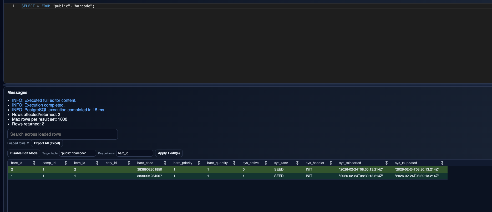

#### Edit Mode fields

- **Enable Edit Mode**: turns grid editing on/off.
- **Target table**: sets update target table (if not auto-detected).
- **Key columns**: defines row identity keys (for example `id`).
- **Apply**: executes updates in the database.

If row identity cannot be resolved correctly, update will fail.

## 6. Database Objects

Left panel categories:

- Tables
- Functions
- Procedures

Clicking an object inserts a SQL template into the editor.

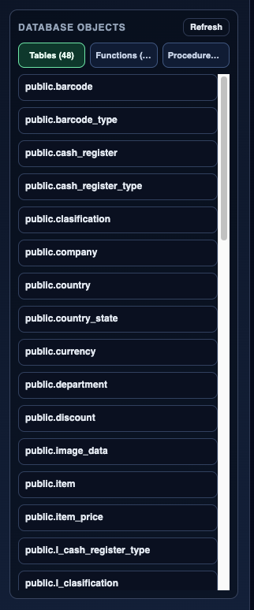

Usage notes:

- table click inserts quick query template,
- function/procedure click inserts matching SQL statement template.

## 7. Favorites and Recent History

For faster work:

- use **Favorites** for frequently used SQL,
- use **Recent History** to quickly reload recent statements.

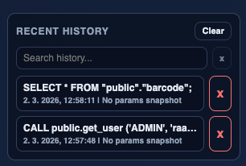

## 8. Autocomplete

Monaco editor supports context-aware autocomplete for:

- SQL keywords,
- schemas and tables,
- functions/procedures,
- columns (based on query context).

Tip:

- open suggestions manually with `Ctrl/Cmd + Space`.

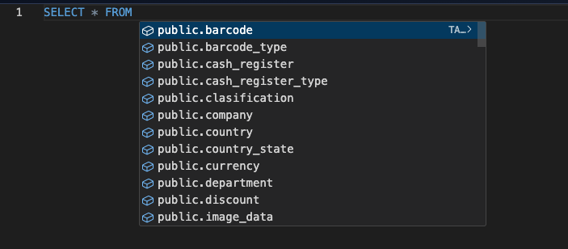

## 9. Command Palette (F1)

Press **F1** to open the editor command palette.

Available SQL commands include:

- SQL: Execute
- SQL: Explain
- SQL: Format SQL
- SQL: Detect Parameters
- SQL: Reload Database Objects

How to use:

1. Press **F1**.
2. Type `>sql`.
3. Select a command.

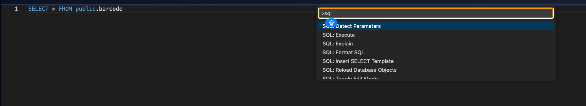

## 10. ER Diagram

In the **ER Diagram** tab you can:

- inspect tables and relations,
- use search/focus,
- refresh model metadata,
- apply Auto Layout.

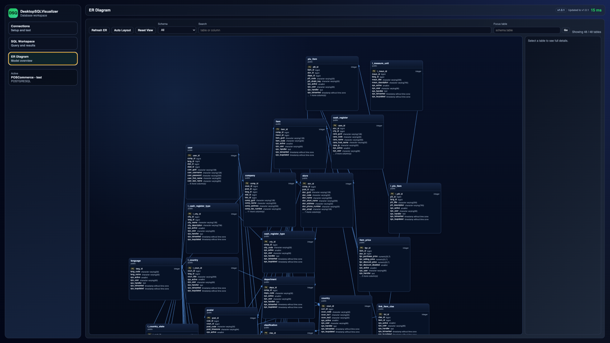

## 11. Application Updates

Top bar shows app version and update status.

Typical statuses:

- `Updated`
- `Downloading update`
- `Update ready`

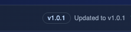

## 12. Common Issues

### Connection fails

Check:

- host/port,
- username/password,
- correct engine selection.

### Too few rows in result

Increase **Max rows** and execute again.

### Support data to provide

When reporting issues, include:

- connection name,
- SQL statement (if possible),
- error text from Messages,
- exact reproduction steps.
